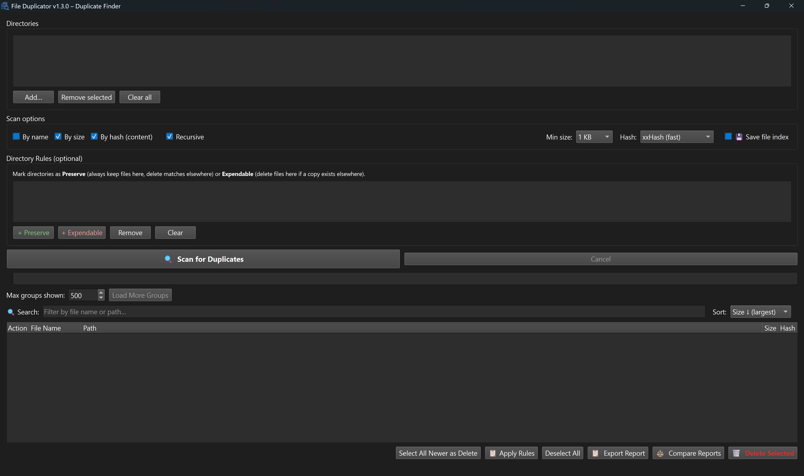
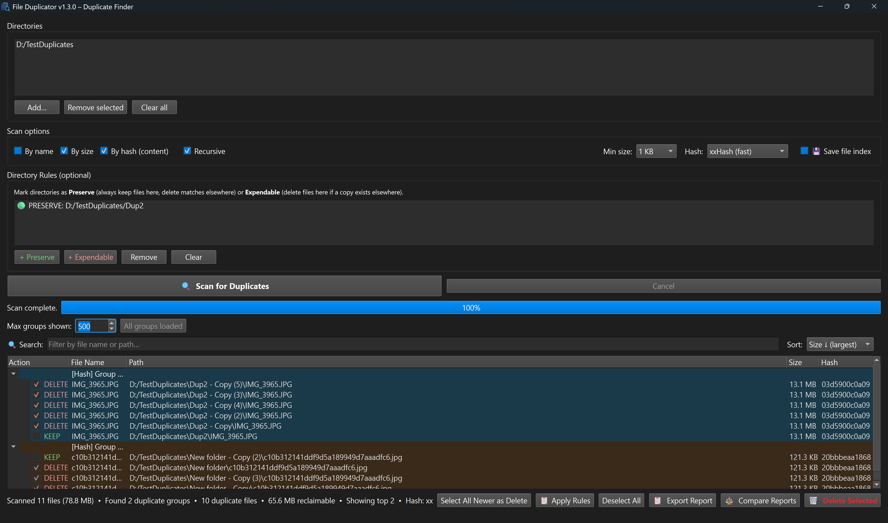

# v1.3.0 – Directory Rules, File Index & Bulk Delete

**Released:** 2026-03-22

---

## ✨ New Features

### Directory Rules (Preserve / Expendable)

Assign rules to directories so the scanner automatically decides which copies to keep or delete:

| Rule | Meaning |
|------|---------|
| **Preserve** | Always **keep** files in this directory — duplicates found elsewhere are marked for deletion |
| **Expendable** | Files here **can be deleted** if a safe copy exists in another (non-expendable) location |

**Resolution logic:**

- If a duplicate group has files in a *preserve* directory and files outside it, the preserve copy is kept and the rest are marked DELETE.
- If two or more *preserve* directories conflict, all copies are marked REVIEW (orange) for manual decision.
- If all copies live in *expendable* directories, the oldest copy is kept.
- Rules use prefix matching on normalised paths, so a rule on `/photos` also covers `/photos/2024/`.

Available in **Desktop (Windows & macOS)** and **Web / Docker** editions.

### 💾 Save File Index (CSV)

Tick **"Save file index"** before scanning and the app writes a CSV of **every** scanned file (not just duplicates) to the first scan directory. Open it in any spreadsheet or text editor to search your disk later without re-scanning.

- Downloadable via the **File Index** button in the toolbar after the scan completes.

### Bulk Delete ALL Duplicates

A new **"Delete ALL Duplicates"** button deletes every file marked DELETE across all groups in one go, with:

- Confirmation modal showing file count and reclaimable space
- Live progress bar with deleted / freed / error counters
- Respects Directory Rules (preserve & review files are never deleted)

### Expand All / Collapse All

New toolbar buttons to expand or collapse all visible duplicate groups at once — handy when browsing hundreds of groups.

### Configurable Page Size

The "Load More" area now includes a **groups-per-page spinner** (10–5000) so you can control how many groups load at a time.

### Spacebar Toggle (KEEP ↔ DELETE)

Press **Space** on any selected file row to toggle it between KEEP and DELETE — works in both the desktop app and the web UI.

- **Desktop:** select one or more rows in the tree, press Space to flip all selected items.
- **Web:** hover or click a file row, press Space to toggle.

---

## 🖥️ Platform Coverage

All features work across all three deployment modes:

- Windows desktop (`.exe`)
- macOS desktop (`.app` / `.dmg`)
- Web UI / Docker (Flask + Bootstrap 5)

---

## 📁 Files Changed

| File | Changes |
|------|---------|
| `scanner.py` | Added `DirectoryRule` dataclass, `apply_directory_rules()` engine |
| `main_window.py` | Rules panel UI, rule persistence, spacebar `keyPressEvent` override, bulk delete |
| `web/app.py` | File index CSV generation, rules extraction, rule-aware serialisation & bulk delete |
| `web/static/app.js` | File index UI, rules state & UI, rule badges, expand/collapse, page size spinner, spacebar toggle, bulk delete modals |
| `web/static/style.css` | `.action-review` and `.rule-badge` styles |
| `web/templates/index.html` | File index checkbox, Directory Rules card, expand/collapse & bulk delete buttons, page size spinner, bulk delete modals |
| `version.py` | `1.2.1` → `1.3.0` |

---

## 📸 Screenshots

### Desktop – Directory Rules panel

### Web – Directory Rules & scan results

